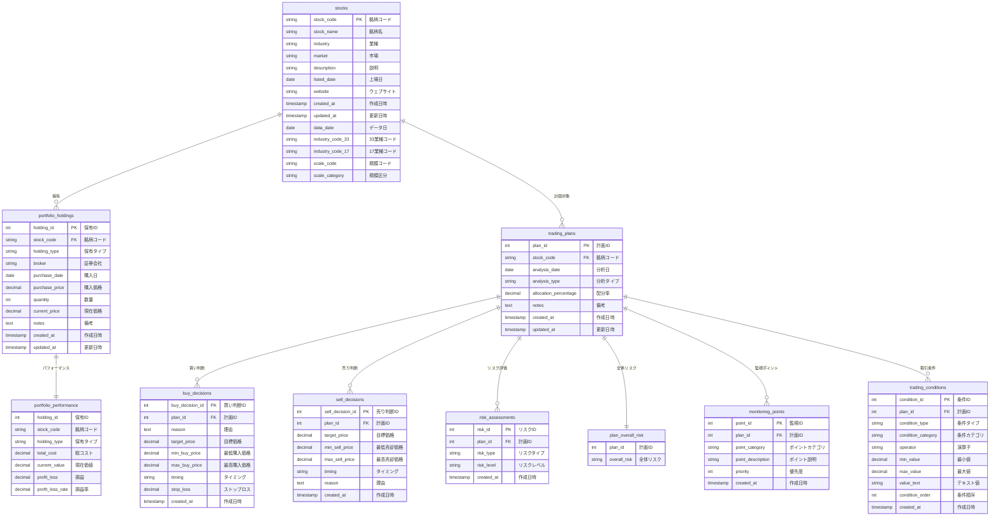

# 株式投資アシスタント - データベースER図

## データベーススキーマ概要

株式投資アシスタントシステムのデータベース構造をMermaid形式で表現したER図です。実際のデータベース構造に基づいて最新化され、外部キー制約が追加されています。

## テーブル間の関係説明

### 主要エンティティ
1. **stocks（銘柄）**
   - 株式の基本情報を管理
   - 業種コード、規模区分などの追加フィールドを含む
   - portfolio_holdings、trading_plansの親エンティティ

2. **portfolio_holdings（ポートフォリオ保有）**
   - 実際の保有状況を管理
   - portfolio_performanceと1対1の関係

3. **trading_plans（取引計画）**
   - 投資計画の基本情報を管理
   - buy_decisions、sell_decisions、risk_assessments、monitoring_points、trading_conditionsの親テーブル

### 判断・評価テーブル
4. **buy_decisions（買い判断）**
   - 買い判断の詳細条件を管理
   - trading_plansと1対多の関係

5. **sell_decisions（売り判断）**
   - 売り判断の詳細条件を管理
   - trading_plansと1対多の関係

6. **risk_assessments（リスク評価）**
   - リスク評価情報を管理
   - trading_plansと1対多の関係

7. **plan_overall_risk（計画全体リスク）**
   - 計画全体のリスク評価を管理
   - trading_plansと1対1の関係

### 監視・条件テーブル
8. **monitoring_points（監視ポイント）**
   - 価格や指標の監視ポイントを管理
   - trading_plansと1対多の関係

9. **trading_conditions（取引条件）**
   - 取引の条件設定を管理
   - trading_plansと1対多の関係

### パフォーマンステーブル
10. **portfolio_performance（ポートフォリオパフォーマンス）**
    - 保有銘柄のパフォーマンス情報を管理
    - portfolio_holdingsと1対1の関係

## 主キーと外部キーの関係

- **主キー（PK）**: 各テーブルの一意な識別子
- **外部キー（FK）**: 他のテーブルとの関連付け（データベース制約付き）
  - `stock_code`: stocksテーブルを参照
  - `plan_id`: trading_plansテーブルを参照
  - `holding_id`: portfolio_holdingsテーブルを参照

## 外部キー制約の詳細

以下の外部キー制約がデータベースに定義されています：

1. **portfolio_holdings → stocks**
   - `stock_code` → `stocks.stock_code`

2. **trading_plans → stocks**
   - `stock_code` → `stocks.stock_code`

3. **buy_decisions → trading_plans**
   - `plan_id` → `trading_plans.plan_id`

4. **sell_decisions → trading_plans**
   - `plan_id` → `trading_plans.plan_id`

5. **risk_assessments → trading_plans**
   - `plan_id` → `trading_plans.plan_id`

6. **monitoring_points → trading_plans**
   - `plan_id` → `trading_plans.plan_id`

7. **trading_conditions → trading_plans**
   - `plan_id` → `trading_plans.plan_id`

## データフローの特徴

1. **銘柄中心の設計**: stocksテーブルを中心に保有情報と計画情報が関連付けられている
2. **計画ベースの判断**: trading_plansを基盤に買い/売り判断、リスク評価、監視ポイント、取引条件が管理される
3. **リスク管理の統合**: 取引計画ごとに詳細リスク評価と全体リスク評価が関連付けられる
4. **監視機能の拡張**: 計画ベースの監視ポイント管理
5. **パフォーマンス追跡**: 保有銘柄のパフォーマンス情報を別途管理

## 重要な変更点

1. **stocksテーブルの拡張**:
   - `data_date`、`industry_code_33`、`industry_code_17`、`scale_code`、`scale_category`フィールドを追加

2. **新しいテーブルの追加**:
   - `portfolio_performance`: ポートフォリオパフォーマンス管理
   - `plan_overall_risk`: 計画全体のリスク評価

3. **外部キー制約の追加**:
   - 7つの外部キー制約をデータベースに追加
   - データ整合性と参照整合性を確保

4. **リレーションシップの正確化**:
   - 外部キー制約に基づいた正確な関係定義
   - trading_plansを中心とした1対多の関係構造

5. **フィールド名の正確化**:
   - monitoring_pointsの`point_id`、`point_category`、`point_description`など
   - trading_conditionsの`condition_category`、`min_value`、`max_value`など

このデータモデルは、株式投資の意思決定プロセスを体系的に管理するための設計となっています。実際のデータベース構造に基づいて正確に表現され、外部キー制約によってデータ整合性が確保されています。
