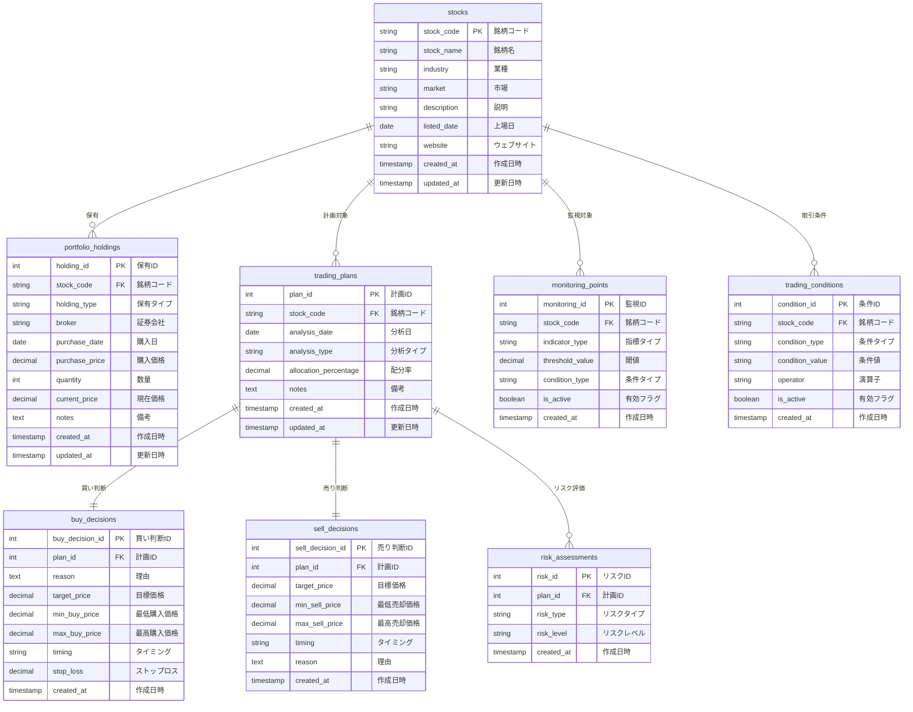

# 株式投資アシスタント - データベースER図

## データベーススキーマ概要

株式投資アシスタントシステムのデータベース構造をMermaid形式で表現したER図です。

## テーブル間の関係説明

### 主要エンティティ
1. **stocks（銘柄）**
   - 株式の基本情報を管理
   - 他のすべてのテーブルの親エンティティ

2. **portfolio_holdings（ポートフォリオ保有）**
   - 実際の保有状況を管理
   - stocksテーブルと1対多の関係

3. **trading_plans（取引計画）**
   - 投資計画の基本情報を管理
   - buy_decisions、sell_decisions、risk_assessmentsの親テーブル

### 判断・評価テーブル
4. **buy_decisions（買い判断）**
   - 買い判断の詳細条件を管理
   - trading_plansと1対1の関係

5. **sell_decisions（売り判断）**
   - 売り判断の詳細条件を管理
   - trading_plansと1対1の関係

6. **risk_assessments（リスク評価）**
   - リスク評価情報を管理
   - trading_plansと1対多の関係

### 監視・条件テーブル
7. **monitoring_points（監視ポイント）**
   - 価格や指標の監視ポイントを管理
   - stocksテーブルと1対多の関係

8. **trading_conditions（取引条件）**
   - 取引の条件設定を管理
   - stocksテーブルと1対多の関係

## 主キーと外部キーの関係

- **主キー（PK）**: 各テーブルの一意な識別子
- **外部キー（FK）**: 他のテーブルとの関連付け
  - `stock_code`: stocksテーブルを参照
  - `plan_id`: trading_plansテーブルを参照

## データフローの特徴

1. **銘柄中心の設計**: stocksテーブルを中心にすべての情報が関連付けられている
2. **計画ベースの判断**: trading_plansを基盤に買い/売り判断が行われる
3. **リスク管理の統合**: 取引計画ごとにリスク評価が関連付けられる
4. **監視機能の拡張**: リアルタイム監視のためのポイント管理

このデータモデルは、株式投資の意思決定プロセスを体系的に管理するための設計となっています。
